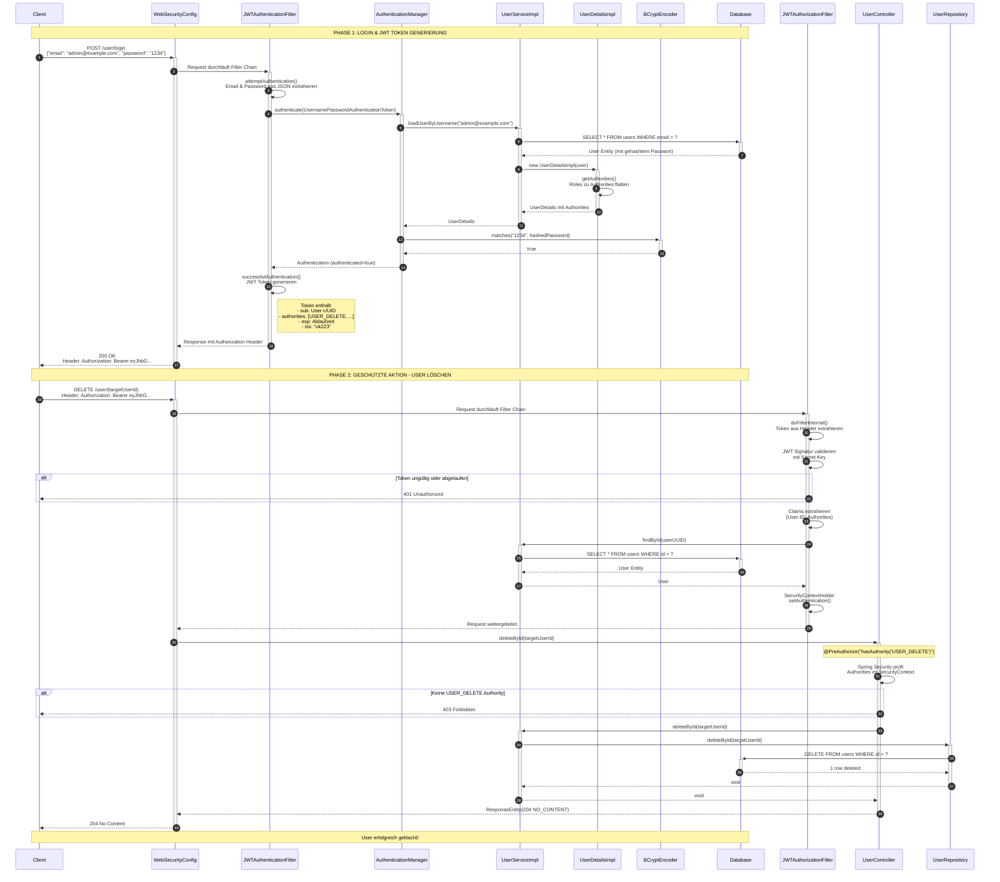

# Sequenzdiagramm: Admin Login & User Löschen

## Use Case Beschreibung

Ein Administrator meldet sich im System an und löscht anschließend einen Benutzer. Dieser Use Case zeigt den kompletten Authentifizierungs- und Autorisierungsflow mit JWT-Tokens.

---

## Sequenzdiagramm

---

## Erklärung der Phasen

### Phase 1: Login & JWT Token Generierung

| Schritt | Komponente | Beschreibung |
|---------|------------|--------------|
| 1-2 | Client → WebSecurityConfig | Client sendet Login-Request mit Email und Passwort |
| 3-4 | JWTAuthenticationFilter | Extrahiert Credentials aus dem JSON-Body |
| 5-8 | AuthenticationManager → UserServiceImpl | Lädt User aus Datenbank anhand der Email |
| 9-10 | UserDetailsImpl | Konvertiert User-Rollen zu Spring Security Authorities |
| 11-12 | BCryptEncoder | Vergleicht eingegebenes Passwort mit gehashtem Passwort |
| 13-14 | JWTAuthenticationFilter | Generiert JWT-Token mit User-ID und Authorities |
| 15-16 | Response | Token wird im Authorization-Header zurückgegeben |

### Phase 2: Geschützte Aktion ausführen

| Schritt | Komponente | Beschreibung |
|---------|------------|--------------|
| 17-18 | Client → WebSecurityConfig | DELETE-Request mit JWT-Token im Header |
| 19-21 | JWTAuthorizationFilter | Extrahiert und validiert JWT-Token |
| 22 | Alt-Flow | Bei ungültigem Token: 401 Unauthorized |
| 23-26 | JWTAuthorizationFilter | Lädt User und setzt SecurityContext |
| 27-28 | UserController | Empfängt Request nach erfolgreicher Autorisierung |
| 29-30 | @PreAuthorize | Prüft ob USER_DELETE Authority vorhanden ist |
| 31 | Alt-Flow | Ohne Berechtigung: 403 Forbidden |
| 32-36 | UserServiceImpl → Database | Löscht User aus der Datenbank |
| 37-38 | Response | 204 No Content - Erfolgreich gelöscht |

---

## Beteiligte Dateien im Code

| Komponente | Datei | Pfad |
|------------|-------|------|
| WebSecurityConfig | `WebSecurityConfig.java` | `src/main/java/com/example/demo/core/security/` |
| JWTAuthenticationFilter | `JWTAuthenticationFilter.java` | `src/main/java/com/example/demo/core/security/` |
| JWTAuthorizationFilter | `JWTAuthorizationFilter.java` | `src/main/java/com/example/demo/core/security/` |
| UserServiceImpl | `UserServiceImpl.java` | `src/main/java/com/example/demo/domain/user/` |
| UserDetailsImpl | `UserDetailsImpl.java` | `src/main/java/com/example/demo/domain/user/` |
| UserController | `UserController.java` | `src/main/java/com/example/demo/domain/user/` |
| UserRepository | `UserRepository.java` | `src/main/java/com/example/demo/domain/user/` |
| BCryptEncoder | `Encoders.java` | `src/main/java/com/example/demo/core/security/` |

---

## Wichtige Sicherheitsaspekte

1. **Passwort-Hashing**: Passwörter werden nie im Klartext gespeichert (BCrypt)
2. **Stateless Authentication**: Keine Server-Sessions, alles im JWT-Token
3. **Token-Validierung**: Signatur wird bei jedem Request geprüft
4. **Role-Based Access Control**: Authorities bestimmen Zugriffsrechte
5. **Method-Level Security**: `@PreAuthorize` schützt einzelne Endpoints
